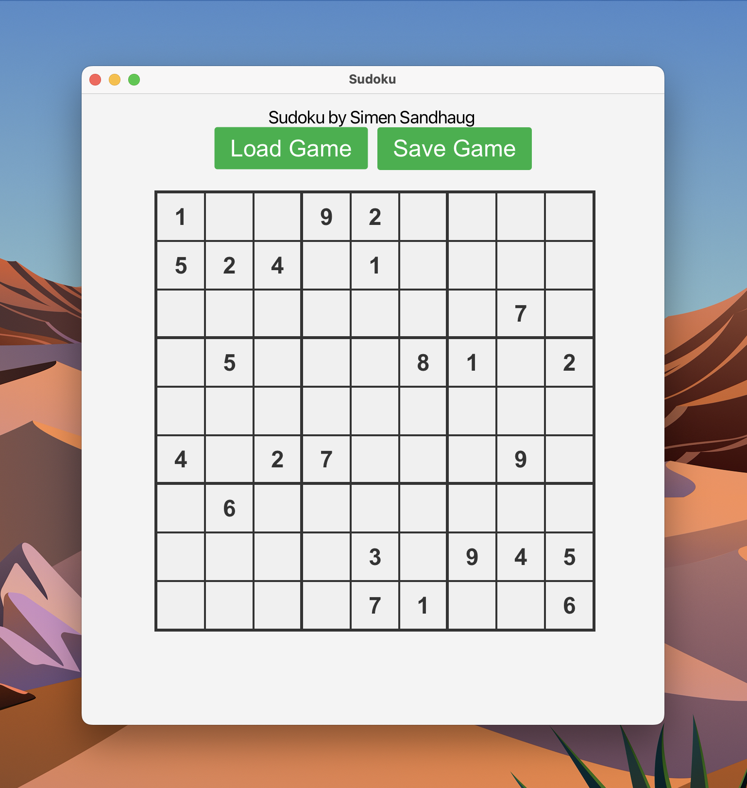
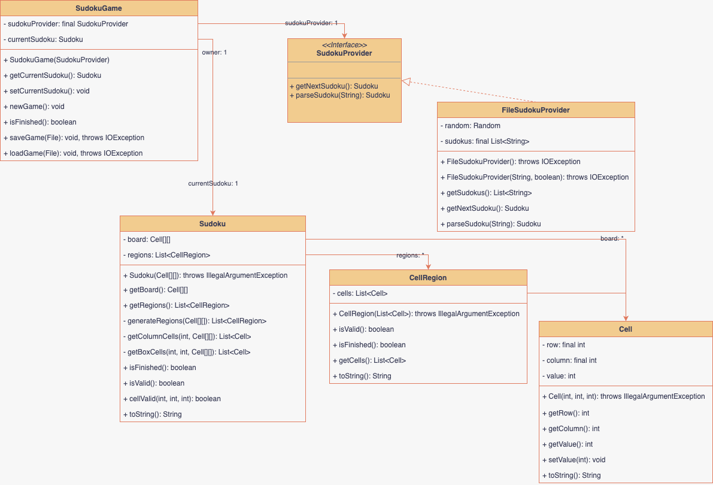

# Documentation for Sudoku

Author: Simen Sandhaug

# Part 1: Description of the app



In this project, I have developed a **Sudoku** game using **Java** and **JavaFX** to create a user-friendly and interactive application. The goal of the application is to provide the user with an interface for solving Sudoku puzzles, and for saving and loading games to and from file `*.txt`.

The application includes several features that enhance the user experience, such as the ability to upload previous games using a specific **[format](#format)**, save their games for later use, and get entirely new games selected from a predefined list. Additionally, the app provides visual feedback indicating whether the input the user enters is valid or not.

To ensure an efficient and maintainable codebase, I have implemented the **Model-View-Controller (MVC)** principle in the design of the application. This has helped separate the logic and interface in the app, making it easier to expand and improve functionality along the way. Through this documentation, I will describe the main features of the application, present a diagram illustrating an essential part of the app, and reflect on my choices and understanding of object-oriented programming and the curriculum in the subject.

The **models** (logic) for the application can be found in the package [sudoku.game](/src/main/java/sudoku/game/)

The **view** and **controller** for the application can be found in the package [sudoku.ui](/src/main/java/sudoku/ui/)

**Utility** classes such as constants and the [FileHelper.java](/src/main/java/sudoku/util/FileHelper.java) class can be found in the package [sudoku.util](/src/main/java/sudoku/util/)

The

# Format

The Sudoku format is saved in a `*.txt` file and looks like this:

> 346179258/187523964/529648371/965832417/472916835/813754629/798261543/631485792/254397186

Here each row is separated with a `/` and there are 9 cells in each row that can represent a number: `[0-9]` (0 represents an empty cell)

# Part 2: Diagram

We were tasked with drawing either a class diagram, object diagram, object state diagram or a sequence diagram. I chose to create a **class diagram** for this Sudoku project.


_(might be a little outdated)_

The diagram shows how the logic section of the app is built up, and is therefore an **interesting/important** part of the application which was the second requirement for this part.

# Part 3: Questions

In this section i will reflect upon my choices while creating the application, and show that i have used and understood key concepts from the course curriculum.

## 1 and 2

##### Interface

One of the requirements for the application was to have atleast one interface. [ISudokuProvider.java](/src/main/java/sudoku/game/interfaces/ISudokuProvider.java) is my one and only interface for this project. The reason is that i didnt feel it necesarry to use interfaces anywhere else due to the simplicity and structure of the app. However, since i have a `isFinished()` method in both the [SudokuGame.java](/src/main/java/sudoku/game/SudokuGame.java) and [Sudoku.java](/src/main/java/sudoku/game/models/Sudoku.java) i could have used an interface to define this. This method brings me to my next point

##### Delegation

In the `isFinished()` method in [SudokuGame.java](/src/main/java/sudoku/game/SudokuGame.java) i call `currentSudoku.isFinished()`. This is an example of delegation, where i refer further and delegate the task to another class. The reason i have done this is so that all the Game logic can be called from the `SudokuController` on one single instance of the [SudokuGame.java](/src/main/java/sudoku/game/SudokuGame.java) class. This ensures that i can have the cleanest code possible, and as little logic in the controller as possible. It also has the state of the game in one place, which is clean.

##### Inheritance

I have not used inheritance in the application, basically due to the simple nature of it, and the fact that no two classes need the same behaviour inherited from a parent. There is no logical or clean way to use inheritance in my application as far as i can see, because doing so would just make a redundant class. None of the classes need the same functionality, so you would effectivly just double one class just for the sake of it. However if i did my logic a little bit differently (more complicated and abstracted), i could have the `Cell` and `CellRegion` classes extend a `Coordinate` or `Position` class, since they both technically could use this logic. Right now i dont need to store the coordinates of the CellRegions, because i only use them for validation of each row, column or 3x3 box (stream and check that all values are non-empty and unique), but if i were to create a Sudoku Solver i could need these positions and what type they are (Row, Col, Box) to apply patterns and Sudoku rules.

##### Java Streams

I have used Java Streams in the application like this in the `CellRegion` class:

```java
    /**
     * Checks whether all cells in this region contain valid values.
     * A value is considered valid if it is unique within the region and is between
     * 1 and 9 (inclusive).
     *
     * @return true if all cells contain valid values, false otherwise.
     */
    public boolean isValid() {
        Set<Integer> uniqueValues = new HashSet<>();
        return cells.stream()
                .map(Cell::getValue)
                .allMatch(value -> value == 0 || uniqueValues.add(value));
    }

    /**
     * Checks whether all cells in this region contain valid and non-zero values.
     *
     * @return true if all cells contain valid and non-zero values, false otherwise.
     */
    public boolean isFinished() {
        return isValid() && cells.stream().noneMatch(cell -> cell.getValue() == 0);
    }
```

I did this because i think streams make the code super clean and also i dont need alot of for loops and indentation to get the same functionality. I could potentially have made these CellRegions implement `Iterable` and created and `Iterator` for them, which would cover more of the curriculum. I could also have made the `Cell` class implement `Comparable` to do the logic of comparing the different cells in a region differently. This just shows that programming has endless ways of solving a task, and no one way is always right.

##### Java Docs

All classes and methods are documented with Java Doc strings, this is to make sure the code is well documented and looks clean.

## 3

I have separated the [models](/src/main/java/sudoku/game/) (logic) of the app, and the [view and controller](/src/main/java/sudoku/ui/) into separate packages. The models do not contain and FXML or JavaFX, and they only contain the logic for the application. The controller class connects the view and the models together, like it should. It detects changes in the view via EventListeners and EventHandlers, and updates the current gamestate and vice versa. It has methods (in the UIHelper helper class) to create the `TextFields` given the board (with cells) and the `FXML` grid it should output to, as well as the listeners on these FXML objects. This makes sure the controller is more easily readable and not filled with FXML generating code and also ensures that the Model-View-Controller principle is kept.

## 4

I have tested all the important parts of the code including saving to and from file. This ensures that there wont be any bugs related to user input in the application. I chose to do this because i had the time, and the tests were pretty simple to set up. It also helped me identify where i needed to implement **error handling**, which was a requirement for the application

The tests can be found in the [/test](/src/test/java/sudoku/) directory.

Example of a test i've written:

[CellTest.java](/src/test/java/sudoku/game/models/CellTest.java)

```java

public class CellTest {

    @Test
    @DisplayName("Test Constructor")
    public void testConstructor() throws IOException {
        Cell cell = new Cell(1, 2, 3);
        assertEquals(1, cell.getRow(), "Row should be 1");
        assertEquals(2, cell.getColumn(), "Col should be 2");
        assertEquals(3, cell.getValue(), "Value should be 3");

        assertThrows(IllegalArgumentException.class, () -> {
            new Cell(9, 9, 10);
            new Cell(-1, -1, -1);
        }, "Row and Column must be between 0 and 8 and value must be between 0 and 9");
    }
}
```

This test checks that the constructor works properly, and that no invalid values can be set.

> Run the app by using this bash command

```bash
❯ java --module-path path/to/javafx-sdk-20/lib --add-modules javafx.controls,javafx.fxml,javafx.graphics,javafx.base -jar sudoku.jar
```

> Replace `path/to/javafx-sdk-20/lib` with the correct path
